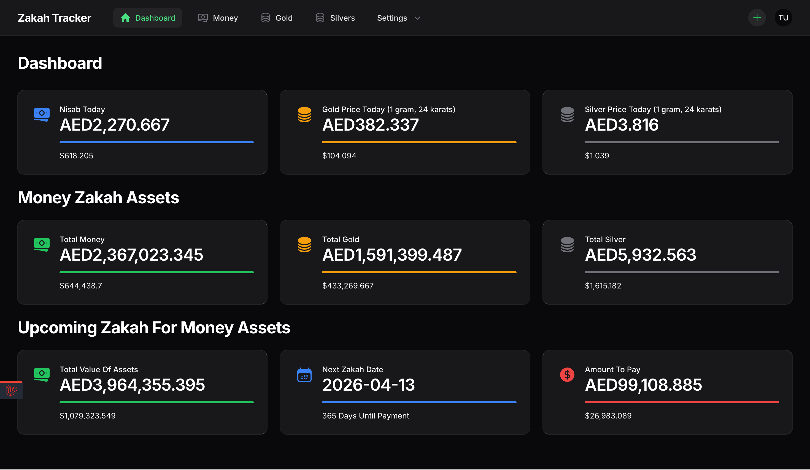
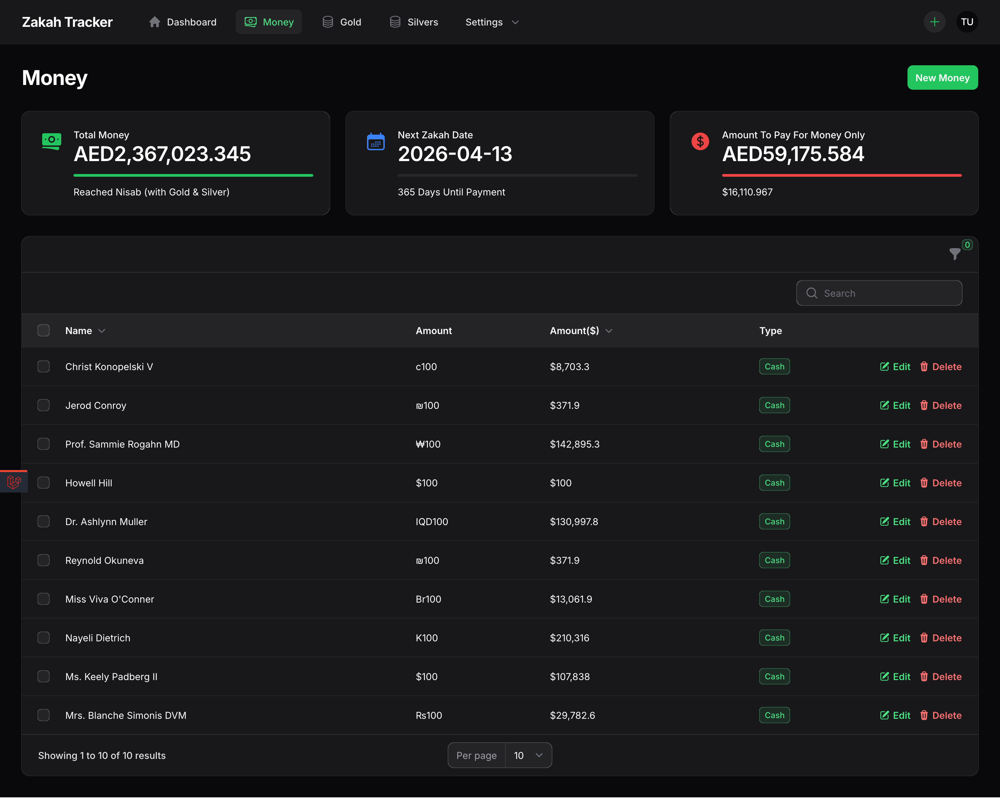
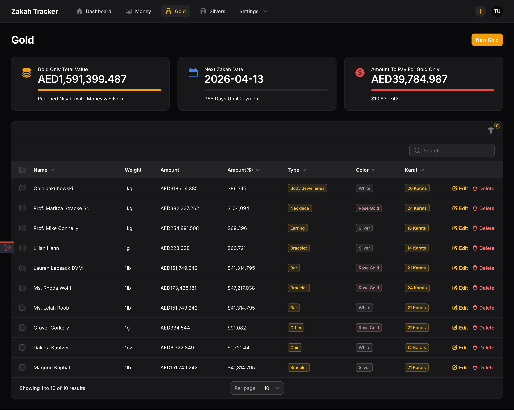
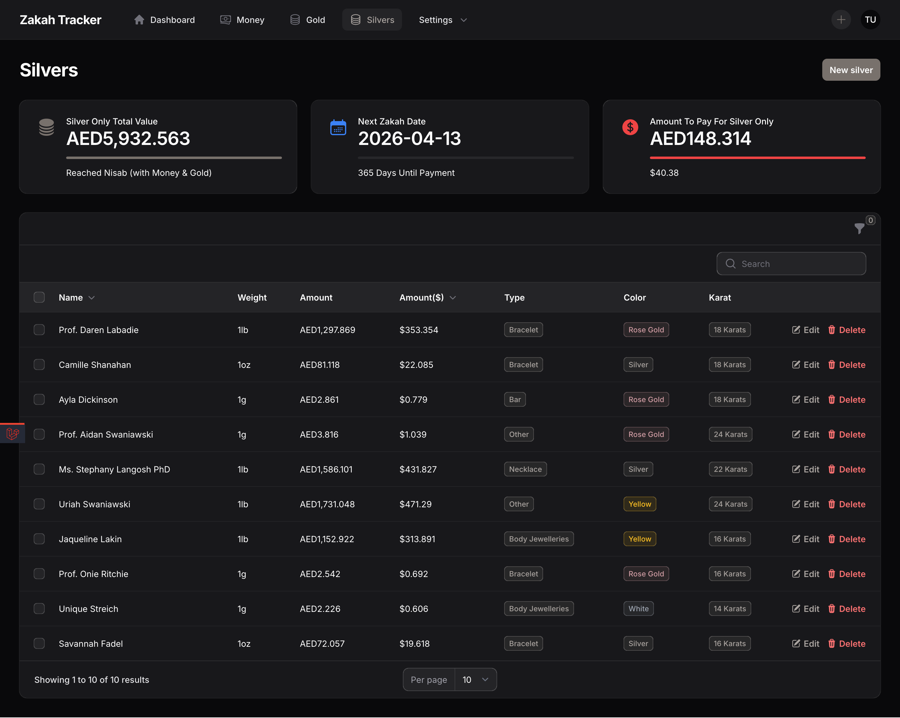
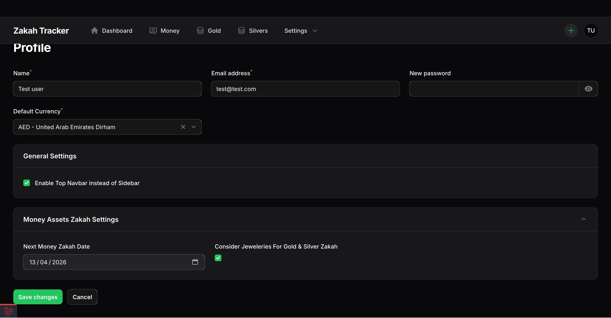
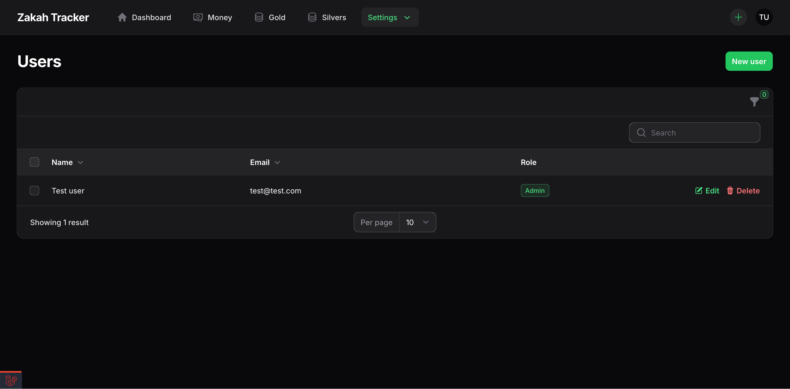

# Getting started
Zakaty is open source tool to manage your assets that are eligible for zakah and have an overview of when and how much to pay so you never miss a payment.

## Is Zakaty Free
Yes, Zakaty is an open source project, completely free.

## Data Collection Policy
Zakaty Doesn't collect any data, it doesn't use any analytics service, nor sending data from your server to any website.

## Screenshots

|              {#remove_header}              |                                      |
|:------------------------------------------:|:------------------------------------:|
|  |    | 
|            |  |
|      |    |
